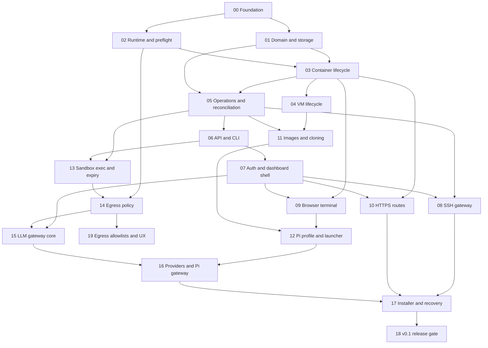

# OpenBox implementation plans

These plans split the approved v0.1 specification into small, dependency-ordered, independently reviewable slices. The [approved design specification](../specs/2026-07-14-openbox-design.md) remains authoritative when a plan is ambiguous.

## Working rules

- Complete slices in dependency order; parallel work is safe only when dependencies are already complete and files do not overlap.
- Begin with the named tests or acceptance checks, then implement the smallest behavior that passes.
- Keep main packages limited to dependency wiring.
- Do not add v0.2 multi-user, multi-host, billing, or extra-agent work to v0.1 slices.
- Every slice updates relevant user/operator/developer documentation.
- Do not claim hardware isolation when the runtime is a system container.
- Do not commit generated secrets, provider credentials, test credentials, or gateway master keys.
- No Git commits are created by these planning files; commit strategy remains the user’s choice.

## Dependency index

| Slice | Milestone | Depends on |
|---|---|---|
| [00-foundation](00-foundation.md) | M1 Core instance engine | — |
| [01-domain-and-storage](01-domain-and-storage.md) | M1 Core instance engine | [`00-foundation`](00-foundation.md) |
| [02-runtime-contract-and-incus-preflight](02-runtime-contract-and-incus-preflight.md) | M1 Core instance engine | [`00-foundation`](00-foundation.md) |
| [03-container-lifecycle](03-container-lifecycle.md) | M1 Core instance engine | [`01-domain-and-storage`](01-domain-and-storage.md), [`02-runtime-contract-and-incus-preflight`](02-runtime-contract-and-incus-preflight.md) |
| [04-vm-lifecycle](04-vm-lifecycle.md) | M1 Core instance engine | [`03-container-lifecycle`](03-container-lifecycle.md) |
| [05-durable-operations-and-reconciliation](05-durable-operations-and-reconciliation.md) | M1 Core instance engine | [`01-domain-and-storage`](01-domain-and-storage.md), [`03-container-lifecycle`](03-container-lifecycle.md) |
| [06-versioned-api-and-cli](06-versioned-api-and-cli.md) | M1 Core instance engine | [`05-durable-operations-and-reconciliation`](05-durable-operations-and-reconciliation.md) |
| [07-owner-auth-and-dashboard-shell](07-owner-auth-and-dashboard-shell.md) | M2 SSH and web access | [`01-domain-and-storage`](01-domain-and-storage.md), [`06-versioned-api-and-cli`](06-versioned-api-and-cli.md) |
| [08-ssh-command-and-instance-gateway](08-ssh-command-and-instance-gateway.md) | M2 SSH and web access | [`05-durable-operations-and-reconciliation`](05-durable-operations-and-reconciliation.md), [`07-owner-auth-and-dashboard-shell`](07-owner-auth-and-dashboard-shell.md) |
| [09-browser-terminal](09-browser-terminal.md) | M2 SSH and web access | [`03-container-lifecycle`](03-container-lifecycle.md), [`07-owner-auth-and-dashboard-shell`](07-owner-auth-and-dashboard-shell.md) |
| [10-https-routes-and-optional-domains](10-https-routes-and-optional-domains.md) | M2 SSH and web access | [`03-container-lifecycle`](03-container-lifecycle.md), [`07-owner-auth-and-dashboard-shell`](07-owner-auth-and-dashboard-shell.md) |
| [11-images-snapshots-and-devbox-cloning](11-images-snapshots-and-devbox-cloning.md) | M3 Devbox and Pi | [`04-vm-lifecycle`](04-vm-lifecycle.md), [`05-durable-operations-and-reconciliation`](05-durable-operations-and-reconciliation.md) |
| [12-pi-profile-and-launcher](12-pi-profile-and-launcher.md) | M3 Devbox and Pi | [`09-browser-terminal`](09-browser-terminal.md), [`11-images-snapshots-and-devbox-cloning`](11-images-snapshots-and-devbox-cloning.md) |
| [13-sandbox-exec-and-expiry](13-sandbox-exec-and-expiry.md) | M4 Sandbox and containment | [`05-durable-operations-and-reconciliation`](05-durable-operations-and-reconciliation.md), [`06-versioned-api-and-cli`](06-versioned-api-and-cli.md) |
| [14-egress-and-instance-network-policy](14-egress-and-instance-network-policy.md) | M4 Sandbox and containment | [`02-runtime-contract-and-incus-preflight`](02-runtime-contract-and-incus-preflight.md), [`13-sandbox-exec-and-expiry`](13-sandbox-exec-and-expiry.md) |
| [15-llm-gateway-security-core](15-llm-gateway-security-core.md) | M5 OpenBox LLM Gateway | [`07-owner-auth-and-dashboard-shell`](07-owner-auth-and-dashboard-shell.md), [`14-egress-and-instance-network-policy`](14-egress-and-instance-network-policy.md) |
| [16-provider-adapters-and-pi-gateway-package](16-provider-adapters-and-pi-gateway-package.md) | M5 OpenBox LLM Gateway | [`12-pi-profile-and-launcher`](12-pi-profile-and-launcher.md), [`15-llm-gateway-security-core`](15-llm-gateway-security-core.md) |
| [17-installer-upgrade-and-recovery](17-installer-upgrade-and-recovery.md) | M6 v0.1 hardening | [`08-ssh-command-and-instance-gateway`](08-ssh-command-and-instance-gateway.md), [`10-https-routes-and-optional-domains`](10-https-routes-and-optional-domains.md), [`16-provider-adapters-and-pi-gateway-package`](16-provider-adapters-and-pi-gateway-package.md) |
| [18-v0.1-hardening-and-release](18-v0.1-hardening-and-release.md) | M6 v0.1 hardening | [`17-installer-upgrade-and-recovery`](17-installer-upgrade-and-recovery.md) |
| [19-egress-allowlists-and-network-ux](19-egress-allowlists-and-network-ux.md) | M4 Sandbox and containment | [`14-egress-and-instance-network-policy`](14-egress-and-instance-network-policy.md) |

## Critical path

## Suggested checkpoints

- **Headless container preview:** slices 00–03.
- **Recoverable core preview:** slices 04–06.
- **Remote-access preview:** slices 07–10.
- **Devbox/Pi preview:** slices 11–12.
- **Sandbox preview:** slices 13–14.
- **Shared-model-access preview:** slices 15–16.
- **v0.1 release candidate:** slices 17–18.
- **Egress allowlist completion:** slice 19 (can proceed after 14; parallel with 15–16 when files do not overlap).
